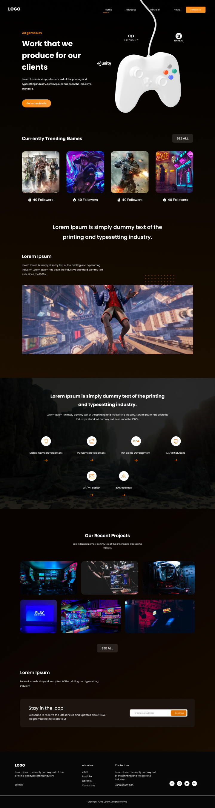

# Strike The Hub | React Gaming Portal



- [Design](https://www.figma.com/design/oTn1jPS3r0KrnWPSVU4PUD/Gaming-Platform---Web-Design--Community-?node-id=1-4&t=l3WOeBCulwbBiSI7-1)
- [Demo](https://gameplatforn.netlify.app/)

# About

Implementation of a multi-page portal dedicated to video games in React.

---

# Run and Build Locally

## All Projects at Once

```bash
pnpm dev # runs all dev servers in parallel
pnpm build # builds everything
```

## Single Project

```bash
pnpm turbo run dev --filter=astro-app
pnpm turbo run build --filter=next-app
```

Check the list of available projects:

```bash
pnpm list -r
```

---

# Author

Developed by Dmitry Lean
